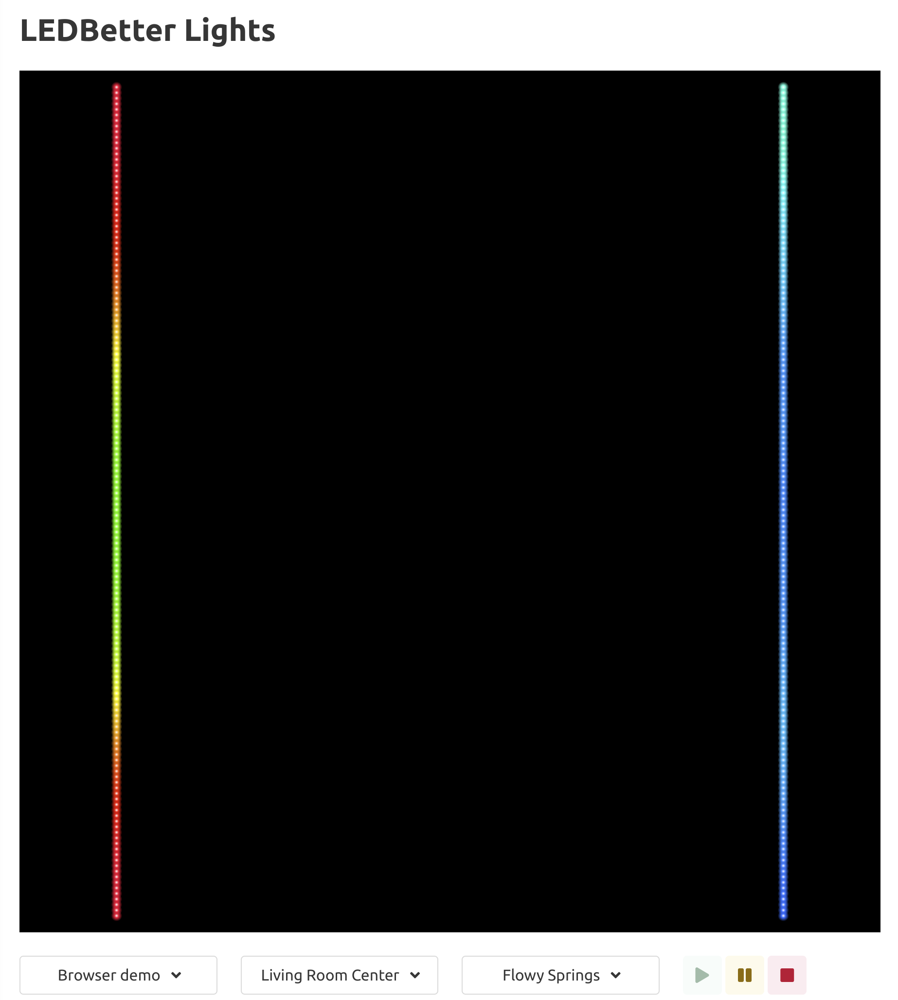
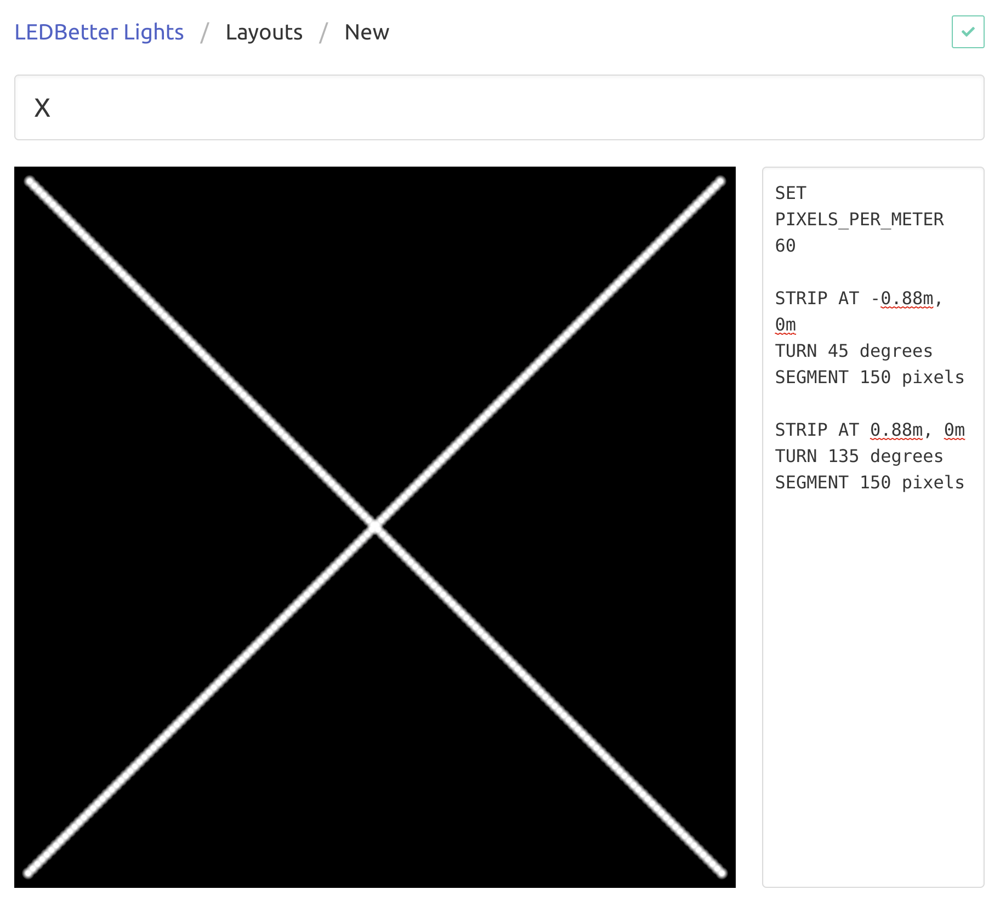

# LEDBetter Lights

LEDBetter Lights is a system for programming [addressable LED strips](https://learn.adafruit.com/adafruit-neopixel-uberguide) with WebAssembly. This consists of three main components:

- [Firmware](/jimpo/ledbetter-firmware) for a driver running on a Raspberry Pi that accepts LED animations compiled as WebAssembly programs and displays it on WS2812B LED addressable strips
- A [web application](/jimpo/ledbetter-app) for controlling the drivers and simulating the animations in-browser
- A Rust embedded DSL in this repo for writing animations

This is a personal project and as such is incomplete, buggy, and built with some admittedly weird design decisions so that I could use certain technologies.

## The Design

The system has a single web server which primary servers as a central database for LEDBetter animations and pixel layouts. It is used to both upload programs to the LED drivers and to preview the animations in the browser. Animations in this context simply mean color patterns changing over time on a collection of 1-dimension LED strips.



Drivers are configured with the IP address of the server (assumed to be on a private network) and connect over unencrypted WebSockets. Once a driver is connected, the web application can be used to run programs on the remote driver. When a program is run, the Wasm is uploaded to the driver device where it executes and refreshes the LED pixel colors periodically according to the program state.

A *pixel layout* is used to represent how the pixel strips will be arranged in a 2-dimensional space, like a wall or ceiling. The web app has a feature for describing, modifying, and saving pixel layouts with a simple DSL.



Animation programs can be uploaded by dragging and dropping the Wasm file to the preview window and saved in a library so they can be run at a later time.

### Why is the web server not hosted on the Pi running the driver?

It could be, but you may want to have multiple installations/drivers on the same network and maintain a single library of programs to run on them.

### Why doesn't the web server execute the animation and stream it to the driver?

That would be very sensible, but I didn't want to do it that way because Edge Computing is *cool*.

## Example program

Below is an example of a simple LED program using the Rust embedded DSL that oscillates between blue and green. See the [examples](examples) directory for more.

```rust
use ledbetter::ledbetter;

#[ledbetter]
mod main {
    use ledbetter::{PixelAnimation, PixelLocation};
    use palette::{encoding::Srgb, Hsv, rgb::{channels::Argb, Rgb}, RgbHue, FromColor};
    use std::f32::consts::PI;

    type Rgb8 = Rgb<Srgb, u8>;

    #[ledbetter(params)]
    pub struct Params {
        pub min_hue: f32,
        pub max_hue: f32,
        pub speed: u32,
    }

    impl Default for Params {
        fn default() -> Self {
            Params {
                min_hue: 140.0,
                max_hue: 220.0,
                speed: 50,
            }
        }
    }

    pub struct Blue {
        steps: usize,
        color: Rgb8,
    }

    #[ledbetter(animation)]
    impl PixelAnimation for Blue {
        type Params = Params;

        fn new(_pixel_locs: Vec<Vec<PixelLocation>>) -> Self {
            Blue {
                steps: 0,
                color: Rgb::new(0, 0, 0),
            }
        }

        fn tick(&mut self, params: &Params) {
            let hue = (1.0 - (self.steps as f32 * 2.0 * PI / params.speed as f32).cos()) / 2.0
                * (params.max_hue - params.min_hue)
                + params.min_hue;
            let hsv = Hsv::new(RgbHue::from_degrees(hue), 1.0, 1.0);
            self.color = Rgb8::from_format(Rgb::from_color(hsv));
            self.steps += 1;
        }

        fn render(&self, _params: &Params, pixels: &mut Vec<Vec<u32>>) {
            for strip in pixels.iter_mut() {
                for pixel in strip.iter_mut() {
                    *pixel = self.color.into_u32::<Argb>();
                }
            }
        }
    }
}
```

## Project status

This is a personal project and there are a bunch of features I would love to add but likely never will. It's complete enough that I run it at home and makes me happy and that's what matters. The code is public because because maybe someone will appreciate it.
